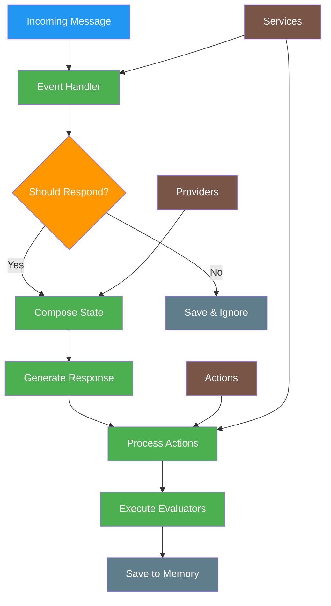

# Complete Developer Guide
Source: https://docs.elizaos.ai/plugin-registry/bootstrap/complete-documentation

Comprehensive technical documentation for the bootstrap plugin's architecture, components, and implementation

## Overview

The `@elizaos/plugin-bootstrap` package is the **core message handler** for elizaOS agents. It provides the fundamental event handlers, actions, providers, evaluators, and services that enable agents to process messages from any communication platform (Discord, Telegram, message bus server, etc.) and generate intelligent responses.

This plugin is essential for any elizaOS agent as it contains the core logic for:

* Processing incoming messages
* Determining whether to respond
* Generating contextual responses
* Managing agent actions
* Evaluating interactions
* Maintaining conversation state

## Architecture Overview



## Message Processing Flow

### 1. Message Reception

When a message arrives from any platform (Discord, Telegram, etc.), it triggers the `MESSAGE_RECEIVED` event, which is handled by the `messageReceivedHandler`.

### 2. Initial Processing

```typescript  theme={null}
const messageReceivedHandler = async ({
  runtime,
  message,
  callback,
  onComplete,
}: MessageReceivedHandlerParams): Promise<void> => {
  // 1. Generate unique response ID
  const responseId = v4();

  // 2. Track run lifecycle
  const runId = runtime.startRun();

  // 3. Save message to memory
  await Promise.all([
    runtime.addEmbeddingToMemory(message),
    runtime.createMemory(message, 'messages'),
  ]);

  // 4. Process attachments (images, documents)
  if (message.content.attachments) {
    message.content.attachments = await processAttachments(message.content.attachments, runtime);
  }

  // 5. Determine if agent should respond
  // 6. Generate response if needed
  // 7. Process actions
  // 8. Run evaluators
};
```

### 3. Should Respond Logic

The agent determines whether to respond based on:

* Room type (DMs always get responses)
* Agent state (muted/unmuted)
* Message content analysis
* Character configuration

### 4. Response Generation

If the agent decides to respond:

1. Compose state with relevant providers
2. Generate response using LLM
3. Parse XML response format
4. Execute actions
5. Send response via callback

## Core Components

### Event Handlers

Event handlers process different types of events in the system:

| Event Type               | Handler                   | Description                          |
| ------------------------ | ------------------------- | ------------------------------------ |
| `MESSAGE_RECEIVED`       | `messageReceivedHandler`  | Main message processing handler      |
| `VOICE_MESSAGE_RECEIVED` | `messageReceivedHandler`  | Handles voice messages               |
| `REACTION_RECEIVED`      | `reactionReceivedHandler` | Stores reactions in memory           |
| `MESSAGE_DELETED`        | `messageDeletedHandler`   | Removes deleted messages from memory |
| `CHANNEL_CLEARED`        | `channelClearedHandler`   | Clears all messages from a channel   |
| `POST_GENERATED`         | `postGeneratedHandler`    | Creates social media posts           |
| `WORLD_JOINED`           | `handleServerSync`        | Syncs server/world data              |
| `ENTITY_JOINED`          | `syncSingleUser`          | Syncs individual user data           |

### Actions

Actions define what an agent can do in response to messages:

#### Core Actions

1. **REPLY** (`reply.ts`)

   * Default response action
   * Generates contextual text responses
   * Can be used alone or chained with other actions

2. **IGNORE** (`ignore.ts`)

   * Explicitly ignores a message
   * Saves the ignore decision to memory
   * Used when agent decides not to respond

3. **NONE** (`none.ts`)
   * No-op action
   * Used as placeholder or default

#### Room Management Actions

4. **FOLLOW\_ROOM** (`followRoom.ts`)

   * Subscribes agent to room updates
   * Enables notifications for room activity

5. **UNFOLLOW\_ROOM** (`unfollowRoom.ts`)

   * Unsubscribes from room updates
   * Stops notifications

6. **MUTE\_ROOM** (`muteRoom.ts`)

   * Temporarily disables responses in a room
   * Agent still processes messages but doesn't respond

7. **UNMUTE\_ROOM** (`unmuteRoom.ts`)
   * Re-enables responses in a muted room

#### Advanced Actions

8. **SEND\_MESSAGE** (`sendMessage.ts`)

   * Sends messages to specific rooms
   * Can target different channels

9. **UPDATE\_ENTITY** (`updateEntity.ts`)

   * Updates entity information in the database
   * Modifies user profiles, metadata

10. **CHOICE** (`choice.ts`)

    * Presents multiple choice options
    * Used for interactive decision making

11. **UPDATE\_ROLE** (`roles.ts`)

    * Manages user roles and permissions
    * Updates access levels

12. **UPDATE\_SETTINGS** (`settings.ts`)

    * Modifies agent or room settings
    * Configures behavior parameters

13. **GENERATE\_IMAGE** (`imageGeneration.ts`)
    * Creates images using AI models
    * Attaches generated images to responses

### Providers

Providers supply contextual information to the agent during response generation:

#### Core Providers

1. **RECENT\_MESSAGES** (`recentMessages.ts`)

   ```typescript  theme={null}
   // Provides conversation history and context
   {
     recentMessages: Memory[],
     recentInteractions: Memory[],
     formattedConversation: string
   }
   ```

2. **TIME** (`time.ts`)

   * Current date and time
   * Timezone information
   * Temporal context

3. **CHARACTER** (`character.ts`)

   * Agent's personality traits
   * Background information
   * Behavioral guidelines

4. **ENTITIES** (`entities.ts`)

   * Information about users in the room
   * Entity relationships
   * User metadata

5. **RELATIONSHIPS** (`relationships.ts`)

   * Social graph data
   * Interaction history
   * Relationship tags

6. **WORLD** (`world.ts`)

   * Environment context
   * Server/world information
   * Room details

7. **ANXIETY** (`anxiety.ts`)

   * Agent's emotional state
   * Stress levels
   * Mood indicators

8. **ATTACHMENTS** (`attachments.ts`)

   * Media content analysis
   * Image descriptions
   * Document summaries

9. **CAPABILITIES** (`capabilities.ts`)

   * Available actions
   * Service capabilities
   * Feature flags

10. **FACTS** (`facts.ts`)
    * Stored knowledge
    * Learned information
    * Contextual facts

### Evaluators

Evaluators perform post-interaction cognitive processing:

#### REFLECTION Evaluator (`reflection.ts`)

The reflection evaluator:

1. **Analyzes conversation quality**
2. **Extracts new facts**
3. **Identifies relationships**
4. **Updates knowledge base**

```typescript  theme={null}
{
  "thought": "Self-reflective analysis of interaction",
  "facts": [
    {
      "claim": "Factual statement learned",
      "type": "fact|opinion|status",
      "in_bio": false,
      "already_known": false
    }
  ],
  "relationships": [
    {
      "sourceEntityId": "initiator_id",
      "targetEntityId": "target_id",
      "tags": ["interaction_type", "context"]
    }
  ]
}
```

### Services

#### TaskService (`task.ts`)

Manages scheduled and background tasks:

```typescript  theme={null}
class TaskService extends Service {
  // Executes tasks based on:
  // - Schedule (repeating tasks)
  // - Queue (one-time tasks)
  // - Validation rules
  // - Worker availability
}
```

Task features:

* **Repeating tasks**: Execute at intervals
* **One-time tasks**: Execute once and delete
* **Immediate tasks**: Execute on creation
* **Validated tasks**: Conditional execution

## Detailed Component Documentation

### Message Handler Deep Dive

#### 1. Attachment Processing

```typescript  theme={null}
export async function processAttachments(
  attachments: Media[],
  runtime: IAgentRuntime
): Promise<Media[]> {
  // For images: Generate descriptions using vision models
  // For documents: Extract text content
  // For other media: Process as configured
}
```

#### 2. Should Bypass Logic

```typescript  theme={null}
export function shouldBypassShouldRespond(
  runtime: IAgentRuntime,
  room?: Room,
  source?: string
): boolean {
  // DMs always bypass shouldRespond check
  // Voice DMs bypass
  // API calls bypass
  // Configurable via SHOULD_RESPOND_BYPASS_TYPES
}
```

#### 3. Response ID Management

```typescript  theme={null}
// Prevents duplicate responses when multiple messages arrive quickly
const latestResponseIds = new Map<string, Map<string, string>>();
// Only process if this is still the latest response for the room
```

### Action Handler Pattern

All actions follow this structure:

```typescript  theme={null}
export const actionName = {
  name: 'ACTION_NAME',
  similes: ['ALTERNATIVE_NAME', 'SYNONYM'],
  description: 'What this action does',
  validate: async (runtime: IAgentRuntime) => boolean,
  handler: async (
    runtime: IAgentRuntime,
    message: Memory,
    state: State,
    options: any,
    callback: HandlerCallback,
    responses?: Memory[]
  ) => boolean,
  examples: ActionExample[][]
}
```

### Provider Pattern

Providers follow this structure:

```typescript  theme={null}
export const providerName: Provider = {
  name: 'PROVIDER_NAME',
  description: 'What context this provides',
  position: 100, // Order priority
  get: async (runtime: IAgentRuntime, message: Memory) => {
    return {
      data: {}, // Raw data
      values: {}, // Processed values
      text: '', // Formatted text for prompt
    };
  },
};
```

## Configuration

### Environment Variables

```bash  theme={null}
# Control which room types bypass shouldRespond check
SHOULD_RESPOND_BYPASS_TYPES=["dm", "voice_dm", "api"]

# Control which sources bypass shouldRespond check
SHOULD_RESPOND_BYPASS_SOURCES=["client_chat", "api"]

# Conversation context length
CONVERSATION_LENGTH=20

# Response timeout (ms)
RESPONSE_TIMEOUT=3600000  # 1 hour
```

### Character Templates

Configure custom templates:

```typescript  theme={null}
character: {
  templates: {
    messageHandlerTemplate: string,
    shouldRespondTemplate: string,
    reflectionTemplate: string,
    postCreationTemplate: string
  }
}
```

## Template Customization

### Understanding Templates

Templates are the core prompts that control how your agent thinks and responds. The plugin-bootstrap provides default templates, but you can customize them through your character configuration to create unique agent behaviors.

### Available Templates

1. **shouldRespondTemplate** - Controls when the agent decides to respond
2. **messageHandlerTemplate** - Governs how the agent generates responses and selects actions
3. **reflectionTemplate** - Manages post-interaction analysis
4. **postCreationTemplate** - Handles social media post generation

### How Templates Work

Templates use a mustache-style syntax with placeholders:

* `{{agentName}}` - The agent's name
* `{{providers}}` - Injected provider context
* `{{actionNames}}` - Available actions
* `{{recentMessages}}` - Conversation history

### Customizing Templates

You can override any template in your character configuration:

```typescript  theme={null}
import { Character } from '@elizaos/core';

export const myCharacter: Character = {
  name: 'TechBot',
  // ... other config ...

  templates: {
    // Custom shouldRespond logic
    shouldRespondTemplate: `<task>Decide if {{agentName}} should help with technical questions.</task>

{{providers}}

<rules>
- Always respond to technical questions
- Always respond to direct mentions
- Ignore casual chat unless it's tech-related
- If someone asks for help, ALWAYS respond
</rules>

<output>
<response>
  <reasoning>Your technical assessment</reasoning>
  <action>RESPOND | IGNORE | STOP</action>
</response>
</output>`,

    // Custom message handler with specific behavior
    messageHandlerTemplate: `<task>Generate a helpful technical response as {{agentName}}.</task>

{{providers}}

Available actions: {{actionNames}}

<personality>
- Be precise and technical but friendly
- Provide code examples when relevant
- Ask clarifying questions for vague requests
- Suggest best practices
</personality>

<output>
<response>
  <thought>Technical analysis of the request</thought>
  <actions>ACTION1,ACTION2</actions>
  <providers>PROVIDER1,PROVIDER2</providers>
  <text>Your helpful technical response</text>
</response>
</output>`,

    // Custom reflection template
    reflectionTemplate: `<task>Analyze the technical conversation for learning opportunities.</task>

{{recentMessages}}

<focus>
- Extract technical facts and solutions
- Note programming patterns discussed
- Track user expertise levels
- Identify knowledge gaps
</focus>

<output>
{
  "thought": "Technical insight gained",
  "facts": [
    {
      "claim": "Technical fact learned",
      "type": "technical|solution|pattern",
      "topic": "programming|devops|architecture"
    }
  ],
  "userExpertise": {
    "level": "beginner|intermediate|expert",
    "topics": ["topic1", "topic2"]
  }
}
</output>`,
  },
};
```

### Template Processing Flow

1. **Template Selection**: The system selects the appropriate template based on the current operation
2. **Variable Injection**: Placeholders are replaced with actual values
3. **Provider Integration**: Provider data is formatted and injected
4. **LLM Processing**: The completed prompt is sent to the language model
5. **Response Parsing**: The XML/JSON response is parsed and validated

### Advanced Template Techniques

#### Conditional Logic

```typescript  theme={null}
messageHandlerTemplate: `{{providers}}

<conditions>
{{#if isNewUser}}
Provide extra guidance and explanations
{{/if}}

{{#if hasAttachments}}
Analyze the attached media carefully
{{/if}}
</conditions>

<response>
  <thought>Context-aware thinking</thought>
  <actions>REPLY</actions>
  <text>Adaptive response</text>
</response>`;
```

#### Custom Provider Integration

```typescript  theme={null}
messageHandlerTemplate: `<context>
{{providers.CUSTOM_CONTEXT}}
{{providers.USER_HISTORY}}
</context>

Generate response considering the custom context above...`;
```

## Understanding the Callback Mechanism

### What is the Callback?

The callback is a function passed to every action handler that **sends the response back to the user**. When you call the callback, you're telling the system "here's what to send back".

### Callback Flow

```typescript  theme={null}
// In an action handler
async handler(runtime, message, state, options, callback) {
  // 1. Process the request
  const result = await doSomething();

  // 2. Call callback to send response
  await callback({
    text: "Here's your response",      // The message to send
    actions: ['ACTION_NAME'],          // Actions taken
    thought: 'Internal reasoning',     // Agent's thought process
    attachments: [],                   // Optional media
    metadata: {}                       // Optional metadata
  });

  // 3. Return success
  return true;
}
```

### Important Callback Concepts

1. **Calling callback = Sending a message**: When you invoke `callback()`, the message is sent to the user
2. **Multiple callbacks = Multiple messages**: You can call callback multiple times to send multiple messages
3. **No callback = No response**: If you don't call callback, no message is sent
4. **Async operation**: Always await the callback for proper error handling

### Callback Examples

#### Simple Response

```typescript  theme={null}
await callback({
  text: 'Hello! How can I help?',
  actions: ['REPLY'],
});
```

#### Response with Attachments

```typescript  theme={null}
await callback({
  text: "Here's the image you requested",
  actions: ['GENERATE_IMAGE'],
  attachments: [
    {
      url: 'https://example.com/image.png',
      contentType: 'image/png',
    },
  ],
});
```

#### Multi-Message Response

```typescript  theme={null}
// First message
await callback({
  text: 'Let me check that for you...',
  actions: ['ACKNOWLEDGE'],
});

// Do some processing
const result = await fetchData();

// Second message with results
await callback({
  text: `Here's what I found: ${result}`,
  actions: ['REPLY'],
});
```

#### Conditional Response

```typescript  theme={null}
if (error) {
  await callback({
    text: 'Sorry, I encountered an error',
    actions: ['ERROR'],
    metadata: { error: error.message },
  });
} else {
  await callback({
    text: 'Successfully completed!',
    actions: ['SUCCESS'],
  });
}
```

### Callback Best Practices

1. **Always call callback**: Even for errors, call callback to inform the user
2. **Be descriptive**: Include clear text explaining what happened
3. **Use appropriate actions**: Tag responses with the correct action names
4. **Include thought**: Help with debugging by including agent reasoning
5. **Handle errors gracefully**: Provide user-friendly error messages

## Integration Guide

### 1. Basic Integration

```typescript  theme={null}
import { Project, ProjectAgent, Character } from '@elizaos/core';

// Define your character with bootstrap plugin
const character: Character = {
  name: 'MyAgent',
      bio: ['An intelligent agent powered by elizaOS'],
  plugins: [
    '@elizaos/plugin-sql',
    '@elizaos/plugin-bootstrap',
  ],
};

// Create the agent
const agent: ProjectAgent = {
  character,
  // Custom plugins go here at agent level
  plugins: [],
};

// Export the project
export const project = {
  agents: [agent]
};
```

### 2. Custom Event Handlers

```typescript  theme={null}
// Add custom handling for existing events
runtime.on(EventType.MESSAGE_RECEIVED, async (payload) => {
  // Custom pre-processing
  await customPreProcessor(payload);

  // Call default handler
  await bootstrapPlugin.events[EventType.MESSAGE_RECEIVED][0](payload);

  // Custom post-processing
  await customPostProcessor(payload);
});
```

### 3. Extending Actions

```typescript  theme={null}
// Create custom action that extends REPLY
const customReplyAction = {
  ...replyAction,
  name: 'CUSTOM_REPLY',
  handler: async (...args) => {
    // Custom logic
    await customLogic();

    // Call original handler
    return replyAction.handler(...args);
  },
};
```

## Examples

### Example 1: Basic Message Flow

```typescript  theme={null}
// 1. Message arrives
const message = {
  id: 'msg-123',
  entityId: 'user-456',
  roomId: 'room-789',
  content: {
    text: 'Hello, how are you?',
  },
};

// 2. Bootstrap processes it
// - Saves to memory
// - Checks shouldRespond
// - Generates response
// - Executes REPLY action
// - Runs reflection evaluator

// 3. Response sent via callback
callback({
  text: "I'm doing well, thank you! How can I help you today?",
  actions: ['REPLY'],
  thought: 'User greeted me politely, responding in kind',
});
```

### Example 2: Multi-Action Response

```typescript  theme={null}
// Complex response with multiple actions
const response = {
  thought: 'User needs help with a technical issue in a specific room',
  text: "I'll help you with that issue.",
  actions: ['REPLY', 'FOLLOW_ROOM', 'UPDATE_SETTINGS'],
  providers: ['TECHNICAL_DOCS', 'ROOM_INFO'],
};
```

### Example 3: Task Scheduling

```typescript  theme={null}
// Register a task worker
runtime.registerTaskWorker({
  name: 'DAILY_SUMMARY',
  validate: async (runtime) => {
    const hour = new Date().getHours();
    return hour === 9; // Run at 9 AM
  },
  execute: async (runtime, options) => {
    // Generate and post daily summary
    await runtime.emitEvent(EventType.POST_GENERATED, {
      runtime,
      worldId: options.worldId,
      // ... other params
    });
  },
});

// Create the task
await runtime.createTask({
  name: 'DAILY_SUMMARY',
  metadata: {
    updateInterval: 1000 * 60 * 60, // Check hourly
  },
  tags: ['queue', 'repeat'],
});
```

## Best Practices

1. **Always check message validity** before processing
2. **Use providers** to gather context instead of direct database queries
3. **Chain actions** for complex behaviors
4. **Implement proper error handling** in custom components
5. **Respect rate limits** and response timeouts
6. **Test with different room types** and message formats
7. **Monitor reflection outputs** for agent learning

## Troubleshooting

### Common Issues

1. **Agent not responding**

   * Check room type and bypass settings
   * Verify agent isn't muted
   * Check shouldRespond logic

2. **Duplicate responses**

   * Ensure response ID tracking is working
   * Check for multiple handler registrations

3. **Missing context**

   * Verify providers are registered
   * Check state composition

4. **Action failures**
   * Validate action requirements
   * Check handler errors
   * Verify callback execution

## Summary

The `@elizaos/plugin-bootstrap` package is the heart of elizaOS's message processing system. It provides a complete framework for:

* Receiving and processing messages from any platform
* Making intelligent response decisions
* Generating contextual responses
* Executing complex action chains
* Learning from interactions
* Managing background tasks

Understanding this plugin is essential for developing effective elizaOS agents and extending the platform's capabilities.
